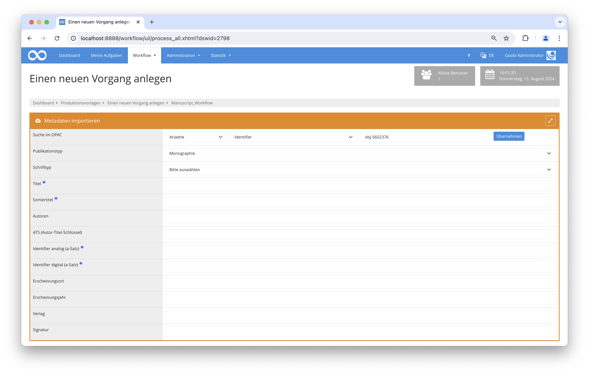

## Einführung
Die vorliegende Dokumentation beschreibt die Installation, Konfiguration und den Einsatz des Plugins. Mit Hilfe dieses Plugins können Daten aus dem Archivportal Mecklenburg-Vorpommern Ariadne abgefragt und in Goobi übernommen werden. Das Portal verfügt über eine OAI Schnittstelle, über die das Plugin die Daten in einem speziellen EAD-Goobi-Format bezieht.


## Installation
Das Plugin besteht aus zwei Dateien:

```bash
plugin_intranda_opac_ariadne-base.jar
plugin_intranda_opac_ariadne.xml
```

Die Dateien müssen für den Nutzer `tomcat` lesbar an folgende Pfaden installiert werden:

```bash
/opt/digiverso/goobi/plugins/opac/plugin_intranda_opac_ariadne-base.jar
/opt/digiverso/goobi/config/plugin_intranda_opac_ariadne.xml
```


## Überblick und Funktionsweise
In Goobi kann nun eine normale OPAC Abfrage ausgeführt werden. Dazu muss der Katalog `Ariadne` ausgewählt werden und der gewünschte Identifier eingetragen werden. Zu beachten ist, dass der Identifier einen Präfix `obj-` benötigt, also z.B. `obj-5602376`.



## Konfiguration
In der Datei `goobi_opac.xml` muss die Schnittstelle zum gewünschten Katalogsystem bekannt gemacht werden. Dies geschieht durch einen Eintrag, der wie folgt aussieht:

```xml
<catalogue title="Ariadne">
    <config description="Ariadne EAD" address="https://ariadne.example.com" port="80" database="2.1" iktlist="IKTLIST-GBV.xml" ucnf="XPNOFF=1" opacType="Ariadne"/>
</catalogue>
 ```

Das Mapping der Metadaten findet in der Datei `plugin_intranda_opac_ariadne.xml` statt:

```xml
<config_plugin>

    <!-- url to the ariadne oai api -->
    <ariadneUrl>https://ariadne,example.com/?page_id=463&amp;verb=GetRecord&amp;metadataPrefix=goobi_ead&amp;identifier=ariadne-portal.uni-greifswald.de:</ariadneUrl>

    <!-- must match a title value in the doctype definition in goobi_opac.xml -->
    <doctype>file</doctype>

    <collection generate="true" prefix="prefix#other prefix#"/>

    <metadatalist>
        <!--
        ruleset: internal metadata name in prefs file
        xpath: xpath expression to evaluate
        element: element name to evaluate the xpath, possible values are c, did, parentC, parentDid, record
        doctype: logical or anchor
        xpathType: attribute or element (default)
        replace: regular expression to manipulate results
         -->

        <metadata ruleset="CatalogIDDigital" xpath="./@id" element="c" doctype="logical" xpathType="attribute" replace="\W"/>
        <metadata ruleset="TitleDocMain" xpath="./oai:unittitle" element="c" doctype="logical"/>
        <metadata ruleset="shelfmarksource" xpath="./oai:unitid[@type='Altsignatur' or not(@type)]" element="did" doctype="logical"/>
    </metadatalist>

</config_plugin>
```

Im Feld `<ariadneUrl>` wird die URL zur OAI-Schnittstelle konfiguriert.

Das Feld `<doctype>` enthält den Namen des Strukturelements. Der verwendete Name muss in der Datei `goobi_opac.xml` definiert sein. Wenn die Sammlung aus dem EAD-Dokument generiert werden soll, dann kann sie im Element `<collection>` konfiguriert werden. Dazu muss das Attribut `generate` auf `true` gesetzt werden. Innerhalb von `prefix` kann ein fester Präfix gesetzt werden, der dem Sammlungsnamen vorangesetzt wird. Alternativ kann die Sammlung auch wie ein normales Metadatum definiert werden.

Metadaten werden innerhalb der `<metadatalist>` definiert. Dort ist das wiederholbare `<metadata>` Element erlaubt. Dieses kann folgende Attribute besitzen:

Element | Beschreibung
------------|-----------
`ruleset` | Name des Feldes im Regelsatz
`xpath` | XPath Ausdruck, mit dem der Wert im EAD Dokument gefunden werden kann
`element` | Name des Feldes, in dem der XPath Ausdruck angewendet wird. Erlaubt sind `c`, `did`, `parentC`, `parentDid` und `record`.
`doctype` | Definiert, wo der Wert eingetragen wird, mögliche Belegung ist `logical` oder `anchor`.
`xpathType` | Legt fest, ob der Wert in einem attribute oder element steht.
`replace` | Regulärer Ausdruck, um den gefundenen Wert zu manipulieren
